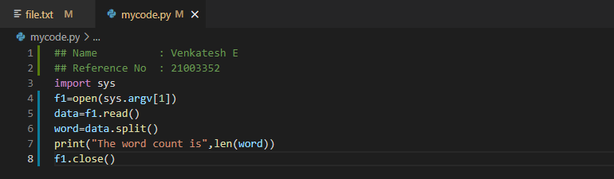
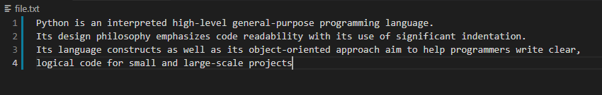
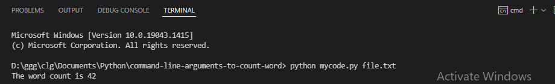

# command-line-arguments-to-count-word
## AIM:
To write a python program for getting the word count from the contents of a file using command line arguments.
## EQUIPEMENT'S REQUIRED: 
PC
Anaconda - Python 3.7
## ALGORITHM: 
### Step 1:
Create a text file in a specific loaction of interest.
### Step 2: 
On the same location as the text file, create a python program file.
### Step 3: 
In python Program, import sys and open a text file with argument "sys.argv[1]"
### Step 4: 
Using read() and split(), split the lines in the file into a sequence of words. 
### Step 5:
Using len() count the number of words in the text file.
### Step 6: 
In command prompt, initiate python followed by program name and text file name to get the output.
## PROGRAM:
~~~
## Name          : Venkatesh E
## Reference No  : 21003352
import sys
f1=open(sys.argv[1])
data=f1.read()
word=data.split()
print("The word count is",len(word))
f1.close()
~~~

### OUTPUT:
Code:

Text file:

Output:

## RESULT:
Thus the program is written to find the word count from the contents of a file using command line arguments.
